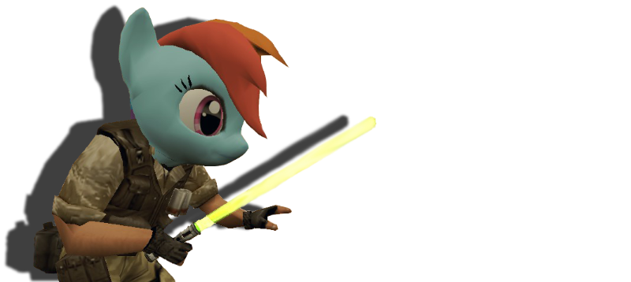

# Hats

_**English** | [Русский](README.ru.md)_



AMX Mod X plugin for Counter-Strike.

The plugin allows the player to wear hats on their heads. The main feature of this modification is the player's ability to choose a skin or a submodel of a headgear on his own and set which of them will be available exclusively to VIP players.

## Commands
* `amx_givehat <player's name> <hat id> <skin/submodel id>` — put on/take off the hat to the player by the player's name (available for users with the "l" flag and in the server console);
* `amx_removehats` — remove hats from each player (available for users with the "l" flag and in the server console);
* `hats` — console command to call the hat selection menu;
* `say /hats` or `say_team /hats` — chat command to call the hat selection menu.

## Configuration
The plugin provides two ways to edit the list of hats: using files `amxmodx/configs/hats.json` and `amxmodx/configs/hats.ini`. The JSON method is more structured and allows for naming of hat's submodels and skins (otherwise the names will be retrieved from the model file), but less compact. The default is the first method. To switch to .ini format, you need to delete or comment out the line `#define USE_JSON`. The plugin automatically detects the number of skins and submodels, so there is no need to set them manually.

### Configuration via hats.json
In addition to the hat name, the markup contains the following fields:
* model: *string* model file name;
* tag: *character* tag (you can leave it blank if you don't want to use skins/submodels);
* vip: *true|false* access for VIP players only (optional field);
* items: *array of strings* names of skins/submodels in the menu (optional field).

Example:
```json
{
    "Santa": {
        "model": "santa_hat_v2.mdl",
        "tag": "s",
        "items": [
            "Red Santa",
            "Blue Santa",
            "Magenta Santa",
            "Cyan Santa"
        ]
    },
    "Dragon Nest Pack": {
        "model": "hats_dn.mdl",
        "vip": true,
        "tag": "b"
    },
    "Minecraft": {
        "model": "pony_antagonist.mdl",
        "tag": "s"
    },
    "Captain BaseBallBat-Boy": {
        "model": "CaptainBaseBallBat-Boy.mdl"
    }
}
```

### Configuration via hats.ini
The hat registration format:
"__mdl__" "__v__`tag`__name__"

where:
* __mdl__ — model file name;
* __v__ — access for VIP players only (for regular players, you can leave it blank);
* `tag` — tag (you can leave it blank if you don't want to use skins/submodels);
* __name__ — name of the hat in the menu.

Example:
* _"Headcrab.mdl" "Headcrab"_ — headcrab hat without additions;
* _"santa_hat_v2.mdl" "sSanta"_ — Santa hat with all skins;
* _"pony_v2.mdl" "cPony"_ — pony hat with skins and submodels;
* _"pony_antagonist.mdl" "vcPony Antagonist"_ — pony VIP hat with skins and submodels.

### Tags:
* _s_ — only skins will be read;
* _b_ — only submodels will be read;
* _c_ — a universal type that does not exclude the possibility of having skins and submodels in the hat at the same time (use it if you are in doubt about choosing a tag or want to combine skins and submodels);
* _t_ — skin or submodel will be set according to the player's team.

## Requirements
- [Reapi](https://github.com/s1lentq/reapi)

## Authors
- [Psycrow](https://github.com/Psycrow101)
